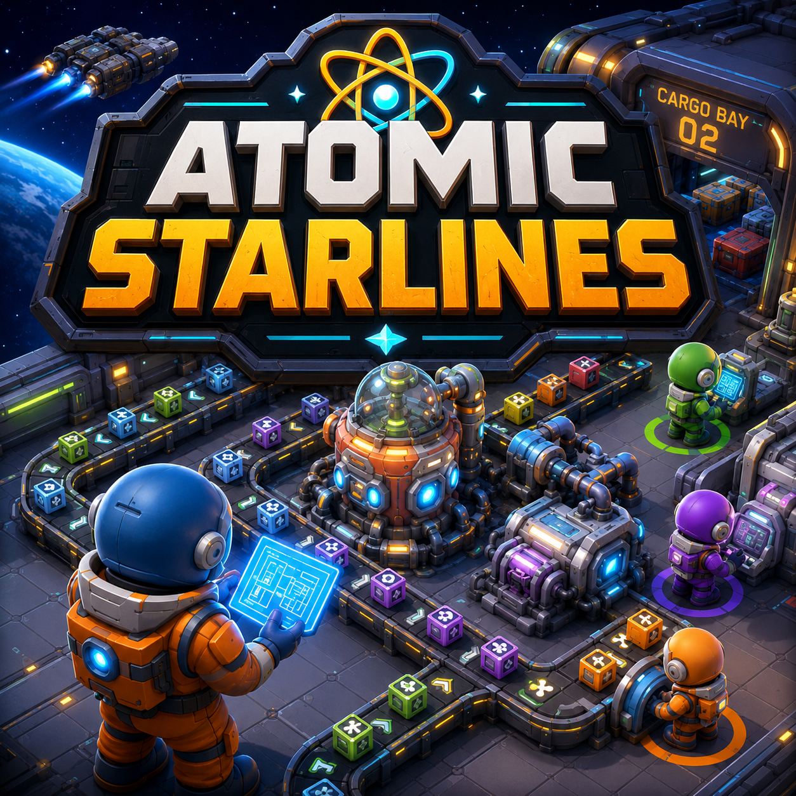

# Atomic Starlines — UE5 Technical Overview

**Atomic Starlines** is an Unreal Engine 5 systems prototype exploring grid-based construction, data-driven gameplay architecture, and multiplayer-aware simulation design.

The project is currently focused on building a strong technical foundation rather than final game content. The goal is to develop clean, modular Unreal systems that can support construction, automation, UI, multiplayer replication, and future simulation features.

**Dev Logs:** https://medium.com/@dreamboy-games

**Co-Dev Website:** https://dreamboygames.com/

## Technical Focus

- Unreal Engine 5 C++ and Blueprint workflows
- Grid-based building placement and validation
- Data-driven building definitions
- Multiplayer-aware gameplay architecture
- Performance-conscious C++ systems design
- Modular actor/component architecture
- Editor-friendly workflows and debug tooling

## Current Prototype Scope

The current prototype centers on a third-person player placing buildings and conveyor-style systems on a ship-based grid. Placement is designed around local client previews, authoritative validation, and future network replication.

Key systems include:

- Ship grid actor and grid components
- Grid coordinate conversion utilities
- Placement validation and footprint checks
- Building definition data assets
- Runtime placed build records
- Preview/ghost placement logic
- Camera and input systems for construction mode

## Repository Purpose

This repository is a technical overview and code sample collection. It is not the full production repository.

It is intended to show:

- How the project is structured
- What systems are being developed
- The architectural direction
- Selected Unreal C++ implementation examples
- Current technical priorities and trade-offs

## Related Project

A previous Unreal Engine prototype, Project Elevate, explored multiplayer arena fighter systems, stylized 3D visuals, animation workflows, and gameplay prototyping. Atomic Starlines builds on that experience with a stronger focus on systemic gameplay, simulation, networking, and long-term architecture.
